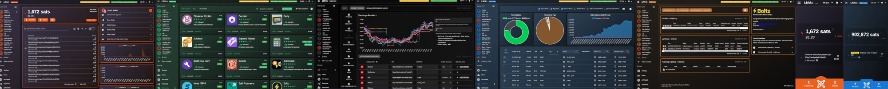
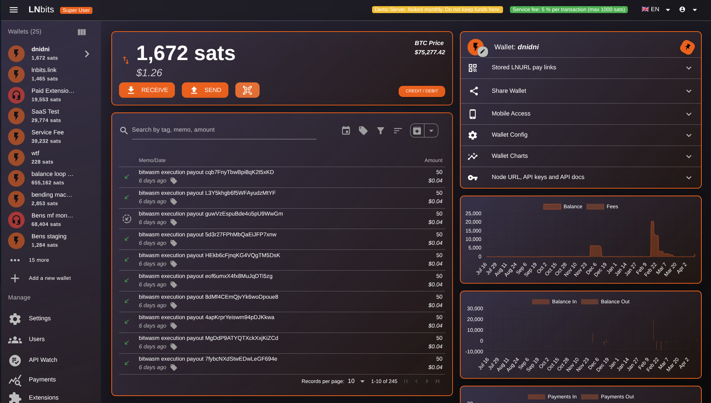
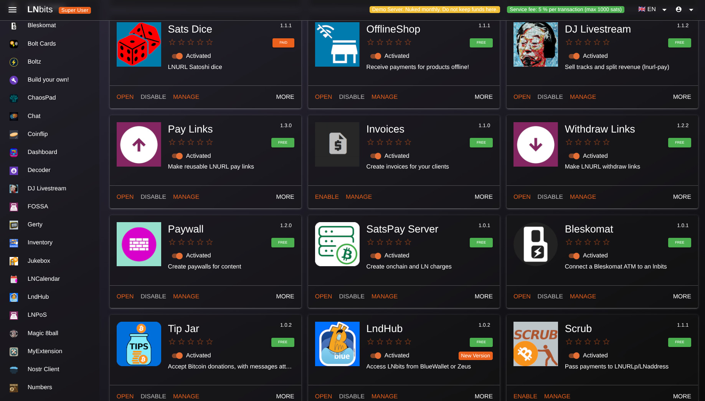
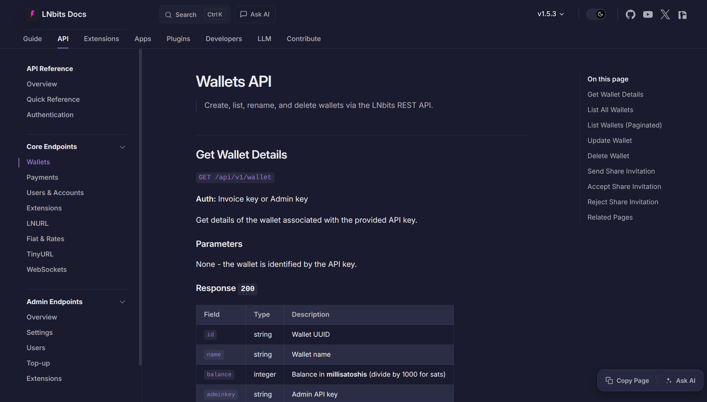
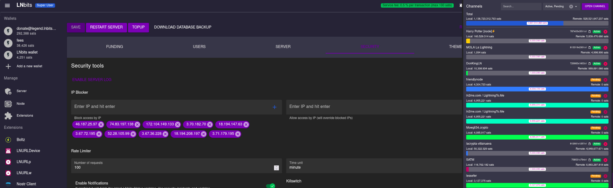
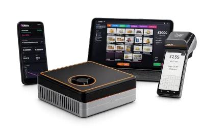

<a href="https://lnbits.com" target="_blank" rel="noopener noreferrer">
  <picture>
    <source media="(prefers-color-scheme: dark)" srcset="docs/logos/lnbits-full-inverse.svg">
    
  </picture>
</a>

 [![license-badge]](LICENSE) [![docs-badge]][docs]       
  

# LNbits — The most powerful Bitcoin & Lightning toolkit

> Run it for yourself, for your community, or as part of a larger stack.

## What is LNbits?

LNbits is a lightweight Python server that sits on top of your Lightning funding source. It gives you safe, isolated wallets, a clean API, and an extension system for rapidly adding features - without locking you into a single node implementation. The Inspiration for LNBits came from ideas pioneered by **OpenNode** and **LNPay** — both today work as funding sources for LNbits.

## What you can do with LNbits

- **Harden app security:** Create per-wallet API keys so individual apps never touch your full balance.
- **Extend functionality fast:** Install extensions to explore and ship Lightning features with minimal code.
- **Build into your stack:** Use the LNbits HTTP API to integrate payments, wallets, and accounting.
- **Cover LNURL flows:** Use LNbits as a reliable fallback wallet for LNURL.
- **Demo in minutes:** Spin up instant wallets for workshops, proofs-of-concept, and user testing.

## Funding sources

LNbits runs on top of most Lightning backends. Choose the one you already operate - or swap later without changing your app architecture.

- Read the [funding source guide](https://docs.lnbits.org/guide/wallets.html)

## Learn more

- Video series on [Youtube](https://www.youtube.com/@lnbits)
- Introduction Video [LNBits V1](https://www.youtube.com/watch?v=PFAHKxvgI9Y&t=19s)

## Running LNbits

See the [install guide](https://github.com/lnbits/lnbits/blob/main/docs/guide/installation.md) for details on installation and setup.

Get yourself familiar and test on our demo server [demo.lnbits.com](https://demo.lnbits.com), or on [lnbits.com](https://lnbits.com) software as a service, where you can spin up an LNbits instance for 21sats per hr.

## LNbits account system

LNbits is packaged with tools to help manage funds, such as a table of transactions, line chart of spending, export to csv. Each wallet also comes with its own API keys, to help partition the exposure of your funding source.

## LNbits extension universe

Extend YOUR LNbits to meet YOUR needs.

All non-core features are installed as extensions, reducing your code base and making your LNbits unique to you. Extend your LNbits install in any direction, and even create and share your own extensions.

## LNbits API

LNbits has a powerful API, many projects use LNbits to do the heavy lifting for their bitcoin/lightning services.

## LNbits node manager

LNbits comes packaged with a light node management UI, to make running your node that much easier.

## LNbits merchant tools

The LNbits stack can process both bitcoin and fiat payments, making it a turnkey, all-in-one solution for merchants. With orders and inventory shared across extensions, and built-in notifications for Nostr, Telegram, and email, LNbits keeps everything in sync, freeing merchants to focus on their business.

## Powered by LNbits

LNbits empowers everyone with modular, open-source tools for building Bitcoin-based systems — fast, free, and extendable.

  

 

[docs]: https://github.com/lnbits/lnbits/wiki
[docs-badge]: https://img.shields.io/badge/docs-lnbits.org-673ab7.svg
[github-mypy]: https://github.com/lnbits/lnbits/actions?query=workflow%3Amypy
[github-mypy-badge]: https://github.com/lnbits/lnbits/workflows/mypy/badge.svg
[github-tests]: https://github.com/lnbits/lnbits/actions?query=workflow%3Atests
[github-tests-badge]: https://github.com/lnbits/lnbits/workflows/tests/badge.svg
[codecov]: https://codecov.io/gh/lnbits/lnbits
[codecov-badge]: https://codecov.io/gh/lnbits/lnbits/branch/master/graph/badge.svg
[license-badge]: https://img.shields.io/badge/license-MIT-blue.svg
